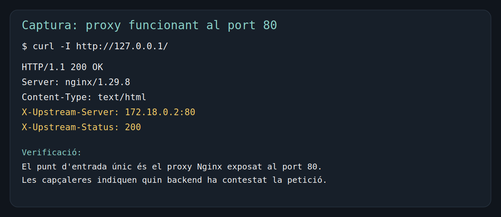
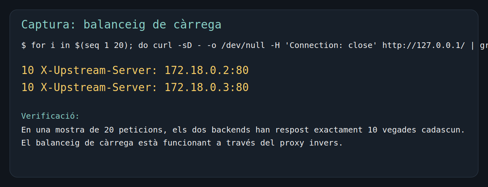
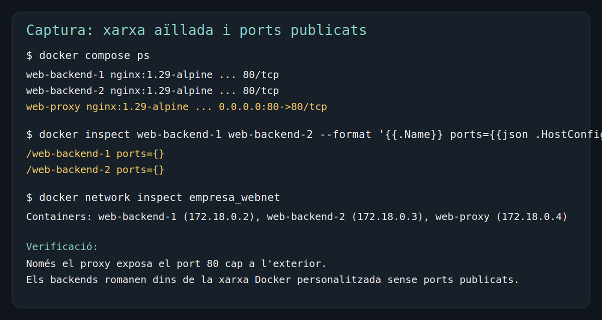

# Infraestructura web amb Docker Compose

## Objectiu

Desplegar una infraestructura web amb Docker Compose que complisca exactament aquests requisits:

- Un únic punt d'entrada per al client al port `80`.
- Dos servidors web darrere d'un proxy invers `Nginx`.
- Balanceig de càrrega entre els dos backends.
- Xarxa interna personalitzada perquè els backends no siguen accessibles directament des de l'host.
- Volum compartit amb el contingut web.
- Ús exclusiu d'imatges oficials de Docker Hub.

## Arquitectura

```text
                    Client / Navegador
                           |
                           | HTTP :80
                           v
                  +----------------------+
                  |  Nginx Reverse Proxy |
                  |      web-proxy       |
                  +----------------------+
                     |                |
                     | balanceig      | balanceig
                     v                v
            +----------------+  +----------------+
            |   backend1     |  |   backend2     |
            | nginx:alpine   |  | nginx:alpine   |
            +----------------+  +----------------+
                     \              /
                      \            /
                       v          v
                 +----------------------+
                 |  Volum compartit     |
                 | empresa_web_content   |
                 +----------------------+

Xarxa Docker personalitzada: empresa_webnet
Només el proxy publica ports cap a l'exterior.
```

## Estructura del projecte

```text
.
├── content-src/
│   ├── index.html
│   └── producte.svg
├── captures/
│   ├── balanceig.svg
│   ├── proxy-funcionament.svg
│   └── xarxa-aillada.svg
├── nginx/
│   └── proxy.conf
├── docker-compose.yml
└── README.md
```

## Decisions de disseny

### 1. Proxy invers

S'ha triat `nginx:1.29-alpine` com a proxy perquè:

- és una imatge oficial de Docker Hub,
- és lleugera,
- permet configurar fàcilment l'upstream i el balanceig,
- permet injectar capçaleres personalitzades per identificar quin backend ha respost.

El proxy escolta al port `80` i afegeix aquestes capçaleres:

- `X-Upstream-Server`: IP i port del backend que ha servit la petició.
- `X-Upstream-Status`: codi d'estat retornat pel backend.

### 2. Backends

S'han triat dos contenidors `nginx:1.29-alpine` com a servidors web perquè:

- són imatges oficials,
- serveixen contingut estàtic sense configuració complexa,
- encaixen perfectament amb el requisit de pàgina simple compartida.

La pàgina inclou:

- text,
- una imatge (`producte.svg`),
- un element multimèdia (`audio` incrustat).

### 3. Xarxa

S'ha definit una xarxa Docker personalitzada anomenada `empresa_webnet`.

Els backends:

- estan connectats a la xarxa interna,
- no publiquen cap port cap a l'host,
- només reben trànsit des del proxy.

El proxy és l'únic servei amb `ports: "80:80"`.

### 4. Volum compartit

S'ha creat el volum Docker `empresa_web_content`, muntat simultàniament en:

- `backend1`
- `backend2`

Per inicialitzar el contingut dins del volum s'utilitza un contenidor auxiliar `busybox:1.36`, també imatge oficial de Docker Hub, que copia el contingut de `content-src/` al volum abans d'arrancar els backends.

Això garanteix que el contingut web servit pels dos servidors resideix realment dins d'un volum compartit i no en dos directoris independents.

## Fitxers principals

- [docker-compose.yml](/mnt/WINDOWS/examen_carlos/docker-compose.yml)
- [nginx/proxy.conf](/mnt/WINDOWS/examen_carlos/nginx/proxy.conf)
- [content-src/index.html](/mnt/WINDOWS/examen_carlos/content-src/index.html)
- [content-src/producte.svg](/mnt/WINDOWS/examen_carlos/content-src/producte.svg)

## Comandes per aixecar l'entorn

```bash
docker compose up -d
docker compose ps
```

## Verificació mínima del professor

Amb el repositori clonat a qualsevol màquina amb Docker i Docker Compose:

```bash
docker compose up -d
```

Després només cal obrir:

```text
http://localhost
```

La web es veurà a través del proxy invers `Nginx`, que és l'únic punt d'entrada publicat.

Per comprovar des de terminal que el balanceig funciona i que les capçaleres del proxy identifiquen el backend que ha respost:

```bash
curl -I http://localhost
```

I per veure clarament que responen els dos backends:

```bash
for i in $(seq 1 10); do
  curl -sD - -o /dev/null -H 'Connection: close' http://localhost \
  | grep -i '^X-Upstream-Server:' | tr -d '\r'
done
```

Han d'aparéixer respostes dels dos servidors backend.

## Comandes de verificació

### 1. Verificar que el proxy respon al port 80

```bash
curl -I http://127.0.0.1/
```

Cal veure:

- `HTTP/1.1 200 OK`
- `X-Upstream-Server`
- `X-Upstream-Status`

### 2. Verificar el balanceig de càrrega

```bash
for i in $(seq 1 20); do
  curl -sD - -o /dev/null -H 'Connection: close' http://127.0.0.1/ \
  | grep -i '^X-Upstream-Server:' | tr -d '\r'
done | sort | uniq -c
```

Han d'aparéixer els dos backends.

### 3. Verificar que els backends no exposen ports

```bash
docker compose ps
docker inspect web-backend-1 web-backend-2 --format '{{.Name}} ports={{json .HostConfig.PortBindings}}'
```

Els dos backends han de mostrar `ports={}` i només el proxy ha d'exposar `0.0.0.0:80->80/tcp`.

### 4. Verificar la xarxa Docker personalitzada

```bash
docker network inspect empresa_webnet
```

Cal comprovar que `web-proxy`, `web-backend-1` i `web-backend-2` pertanyen a la mateixa xarxa personalitzada.

### 5. Verificar el volum compartit

```bash
docker inspect web-backend-1 web-backend-2 --format '{{.Name}} mounts={{json .Mounts}}'
docker exec web-backend-1 sh -c "echo compartit-des-del-backend1 > /usr/share/nginx/html/volum-check.txt"
docker exec web-backend-2 cat /usr/share/nginx/html/volum-check.txt
```

Si `backend2` pot llegir el fitxer escrit des de `backend1`, el volum compartit funciona correctament.

## Evidències del funcionament

### Proxy funcionant al port 80



### Balanceig de càrrega entre els dos backends



### Xarxa aïllada i backends sense ports publicats



## Resultats obtinguts en la verificació

Durant la validació real d'aquest desplegament s'ha comprovat:

- el proxy respon correctament a `http://127.0.0.1:80`,
- el proxy injecta `X-Upstream-Server` i `X-Upstream-Status`,
- en una mostra de 20 peticions s'han repartit `10` peticions a `172.18.0.2:80` i `10` a `172.18.0.3:80`,
- `backend1` i `backend2` no publiquen ports al host,
- els tres contenidors estan units a la xarxa personalitzada `empresa_webnet`,
- els dos backends munten el mateix volum `empresa_web_content`,
- un fitxer escrit des de `backend1` s'ha pogut llegir des de `backend2`.

## Aturar i eliminar l'entorn

```bash
docker compose down
```
